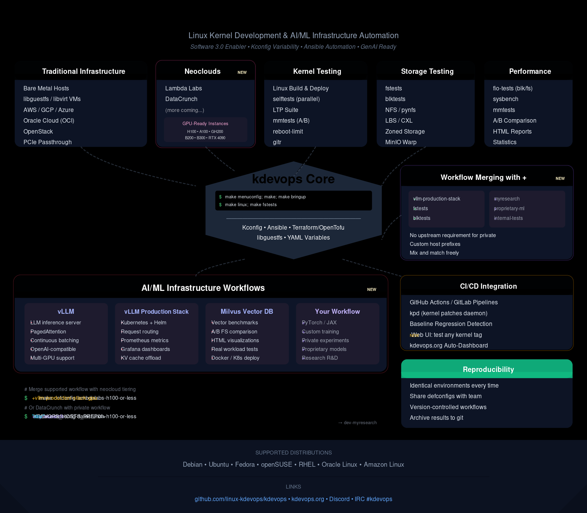

Testing

Table of Contents
=================

* [kdevops](#kdevops)
   * [Generative AI usage on kdevops](#generative-ai-usage-on-kdevops)
      * [Resources for leveraging generative AI on kdevops](#resources-for-leveraging-generative-AI-on-kdevops)
   * [Quick kdevops demos](#quick-kdevops-demos)
      * [Start kernel hacking in just 4 commands](#start-kernel-hacking-in-just-4-commands)
      * [Start running fstests in 2 commands](#start-running-fstests-in-2-commands)
      * [Start running blktests in 2 commands](#start-running-blktests-in-2-commands)
      * [Start testing NFS with in 2 commands](#start-testing-nfs-with-in-2-commands)
      * [Runs some kernel selftests in a parallel manner](#runs-some-kernel-selftests-in-a-parallel-manner)
      * [CXL](#cxl)
      * [reboot-limit](#reboot-limit)
      * [sysbench](#sysbench)
      * [fio-tests](#fio-tests)
      * [AI workflow](#ai-workflow)
   * [kdevops chats](#kdevops-chats)
   * [kdevops on discord](#kdevops-on-discord)
      * [kdevops IRC](#kdevops-irc)
   * [Parts to kdevops](#parts-to-kdevops)
* [kdevops workflow documentation](#kdevops-workflow-documentation)
   * [kdevops shared workflows](#kdevops-shared-workflows)
   * [kdevops workflows which may be dedicated](#kdevops-workflows-which-may-be-dedicated)
* [kdevops general documentation](#kdevops-general-documentation)
* [kdevops kernel-ci support](#kdevops-kernel-ci-support)
* [kdevops organization](#kdevops-organization)
* [kdevops tests results](#kdevops-tests-results)
* [Video presentations on kdevops or related](#video-presentations-on-kdevops-or-related)
* [Underneath the kdevops hood](#underneath-the-kdevops-hood)
   * [License](#license)

# kdevops

The master git repo for kdevops is:

  * https://github.com/linux-kdevops/kdevops


kdevops provides a framework for automation for optimal Linux kernel development
and testing. It is intended to help you both be able to ramp up with any complex
Linux kernel development environment super fast, and to also let you ramp up
an entire lab for Linux kernel testing for a complex subsystem in a jiffy.

It makes use of local ansible roles and optionally lets you use
[libguestfs](https://libguestfs.org/) with libvirt or terraform in order
to support an cloud provider. Support for vagrant in kdevops exists but is now
deprecated in favor of [libguestfs](https://libguestfs.org/) since vagrant
lacks any active maintenance, new development should use and focus on
[libguestfs](https://libguestfs.org/).

Variability is provided through the same variability language used in the Linux
kernel, kconfig. It is written by Linux kernel developers, for Linux kernel
developers. The project aims to enable support for all Linux distributions.

kdevops supports [PCIe passthrough](docs/libvirt-pcie-passthrough.md)
when using virtualization and allows you to pick and choose onto which guest
any PCIe device gets passed onto. This could be all devices to one guest
or you get to pick what device goes to a specific guest. You can for example
even end up with many guests and each guest gets one PCIe passthrough device
assigned, all through kconfig.

kdevops [PCIe passthrough](docs/libvirt-pcie-passthrough.md) support is
supported using [kdevops dynamic kconfig](docs/kdevops-dynamic-configuration.md), a
new target is provided 'make dynconfig' which let's kdevops generate Kconfig
files dynamically based on your system environment. This mechanism will be
expanded in the future to make kdevops even more dynamic to support even more
features.

## Generative AI usage on kdevops

The kdeovps project significantly enhances the speed and accuracy of generative
AI for extending its features and adding new workflows. This capability was a
core design principle. While
[generative AI may not yet be optimal for all Linux kernel development](https://neurips.cc/virtual/2024/poster/97426),
we lower the barrier to its use on kdevops by adopting a structured,
declarative approach to defining and implementing Linux workflows.

Kconfig serves as our clear modeling variability language, providing precise
symbol dependency relationships and encouraging symbol documentation through
straightforward language.

We've also
[extended kconfig with optional selective YAML output](https://github.com/linux-kdevops/kconfig/commit/2665aeb3b7e0a524e15de31937e8e4344fc131ba)
enabling a direct one-to-one mapping of model variability to Ansible input
variables. Ansible's YAML-based Task Language offers a well-defined structure
for describing tasks, handlers, plays, and roles, which effectively removes
ambiguity regarding goals and objectives.

We've pushed the limits of Kconfig's leverage, making what would otherwise
be complex functionality such as adding support for new filesystems as simple
as extending Kconfig files. For example, see the
[kdevops mmtests filesystem support Kconfig file](https://github.com/linux-kdevops/kdevops/blob/main/workflows/mmtests/Kconfig.xfs).

Our long-term hypothesis was that by minimizing actual code implementation and
instead using stricter modeling variability languages -- assisted by
documentation via help menus and clear declarative tasks -- we could more
effectively leverage generative AI to extend kdevops. This hypothesis is
proving true, allowing us to utilize AI agents now like
[Claude Code](https://www.anthropic.com/claude-code) for many kdevops
modifications.

The kdevops project fundamentally acts as a
[Software 3.0 enabler for Linux kernel development](https://www.latent.space/p/s3).
New workflows are now being added with generative AI, and the entire
[kdevops dashboard](https://kdevops.org/) is fully generated by generative AI.
Recent efforts also enable CI integration without developers needing to touch
any CI files, which was a deliberate design choice given the inherent
complexity and debugging challenges of continuous integration configurations.

### Resources for leveraging generative AI on kdevops

To assist both humans and bots with examples on how to leverage generative AI
on kdevops, refer to these documentation files:

  * [CLAUDE.md](CLAUDE.md) - Claude Code guidelines
  * [PROMPTS.md](PROMPTS.md) - Example of prompts and respective commits

## Quick kdevops demos

To give you an idea of the power and goals behind kdevops we provide a few
quick demos of what you can do below. More workflows will be added with time.
Additional documentation detailing how to get started as well as how to add new
workflows follows the quick demos.

### Start kernel hacking in just 4 commands

Configure kdevops to use bare metal, cloud or a local vm based solution, pick
your distribution of choice, enable the Linux kernel workflow, select target
git tree, and get up and running on a freshly compiled Linux git tree in just
4 commands:

  * `make menuconfig`
  * `make`
  * `make bringup`
  * `make linux`
  * `make linux HOSTS="kdevops-xfs-crc kdevops-xfs-reflink"` for example if you wanted to restrict running the above command only to the two hosts listed

To uninstall the "6.6.0-rc2" kernel from all nodes:

  * `make linux-uninstall KVER="6.6.0-rc2"`

### Start running fstests in 2 commands

To test a kernel against fstests, for example, if you enable the fstests
workflow you can just run:

  * `make fstests`
  * `make fstests-baseline`
  * `make fstests-results`

For more details see [kdevops fstests docs](docs/fstests.md)

### Start running blktests in 2 commands

To test a kernel against fstests, for example, if you enable the blktests
workflow you can just run:

  * `make blktests`
  * `make blktests-baseline`
  * `make blktests-results`

For more details see [kdevops blktests docs](docs/blktests.md)

### Start testing NFS in 2 commands

To test the kernel's nfs server with the pynfs testsuite, enable the pynfs
workflow and then run:

  * `make pynfs`
  * `make pynfs-baseline`

For more details see [kdevops nfs docs](docs/nfs.md)

### Start running the git regression suite in 2 commands

To test a kernel using the git regression suite, enable the gitr workflow
and then run:

  * `make gitr`
  * `make gitr-baseline`

For more details see [kdevops gitr docs](docs/gitr.md)

### Start running the ltp suite in 2 commands

To test a kernel using the ltp suite, enable the ltp workflow and then run:

  * `make ltp`
  * `make ltp-baseline`

For more details see [kdevops ltp docs](docs/ltp.md)

### Start running the nfstest suite in 2 commands

To test a kernel using the nfstest suite, enable the nfstest workflow and
then run:

  * `make nfstest`
  * `make nfstest-baseline`

For more details see [kdevops nfstest docs](docs/nfstest.md)

### Runs some kernel selftests in a parallel manner

kdevops supports running Linux kernel selftests in parallel, this is as easy as:

  * `make selftests`
  * `make selftests-baseline`

You can also run specific tests:

  * `make selftests-firmware`
  * `make selftests-kmod`
  * `make selftests-sysctl`

For more details see [kdevops nfs docs](docs/selftests.md)

### mmtests - Memory Management and Performance Testing

kdevops supports running comprehensive memory management and performance tests through mmtests:

  * `make mmtests` - Run memory management benchmarks
  * `make mmtests-compare` - Compare baseline vs development kernel performance (A/B testing)

Quick A/B testing setup:
```bash
make defconfig-mmtests-ab-testing-thpcompact  # Configure for A/B testing
make bringup                                  # Provision baseline and dev nodes
make mmtests                                  # Run tests on both nodes
make mmtests-compare                          # Generate comparison reports
```

Results are generated in `workflows/mmtests/results/compare/` with HTML reports,
performance graphs, and statistical analysis for easy regression detection.

### CXL

There is CXL support. You can either use virtualized CXL devices or with
[PCIe passthrough](docs/libvirt-pcie-passthrough.md) you can assign devices
to guests and create custom topologies. kdevops let you build and install
the latest CXL enabled qemu version as well for you. For more details
refer to [kdevops cxl docs](docs/cxl.md)

### reboot-limit

Test system stability and boot performance with continuous reboots:

```bash
make defconfig-reboot-limit
make
make bringup
make reboot-limit-baseline
make reboot-limit-graph
```

The reboot-limit workflow helps identify boot regressions, hardware issues,
and kernel stability problems. For more details see [kdevops reboot-limit docs](docs/reboot-limit.md).

### sysbench

kdevops supports automation of sysbench tests on VMs with or without
[PCIe passthrough](docs/libvirt-pcie-passthrough.md) and different cloud
providers. For details refer to the
[kdevops sysbench documentation](docs/sysbench/sysbench.md).

### fio-tests

kdevops includes comprehensive storage performance testing through the fio-tests
workflow, adapted from the original [fio-tests framework](https://github.com/mcgrof/fio-tests).
This workflow provides flexible I/O benchmarking with configurable test matrices,
A/B testing capabilities, and advanced graphing and visualization support. For
detailed configuration and usage information, refer to the
[kdevops fio-tests documentation](docs/fio-tests.md).

### MinIO Warp S3 benchmarking

kdevops supports S3 storage performance testing through MinIO Warp benchmarking.
This workflow provides automated MinIO deployment and S3 API performance testing
with support for different filesystems and block sizes.

For detailed documentation and demo results, see the
[MinIO Warp documentation](docs/minio-warp/).

### AI workflow

kdevops now supports AI/ML system benchmarking, starting with vector databases
like Milvus. Similar to fstests, you can quickly set up and benchmark AI
infrastructure with just a few commands:

```bash
make defconfig-ai-milvus-docker
make bringup
make ai
make ai-results
```

The AI workflow supports:
- **Vector Database Benchmarking**: Milvus performance testing with real-world workloads
- **A/B Testing**: Compare baseline vs development configurations
- **Filesystem Impact Analysis**: Performance across XFS, ext4, btrfs
- **Demo Results**: View actual benchmark HTML reports and performance visualizations

For details and demo results, see:
- [kdevops AI workflow documentation](docs/ai/README.md)
- [Milvus performance demo results](docs/ai/vector-databases/milvus.md#demo-results)

## kdevops chats

We use discord and IRC. Right now we have more folks on discord than on IRC.

## kdevops on discord

We have a public chat server up, for now we use discord:

  * https://bit.ly/linux-kdevops-chat

### kdevops IRC

We are also on irc.oftc.net on #kdevops

## Parts to kdevops

It is best to think about kdevops in phases of your desired target workflow.
The first thing you need to do is get systems up. You either are going to
use baremetal hosts, use a cloud solution, or spawn local virtualized guests.

The phases of use of kdevops can be split into:

  * Bring up
  * Make systems easily accessible, and install generic developer preferences
  * Run defined workflows



---

# kdevops workflow documentation

A kdevops workflow is a type of target work environment you want to run in.
Different workflows have different kernel requirements, sometimes cloud or qemu
requirements and also enable new make targets for building things or test
targets. Some workflows are generic and may be shared such as that for Linux to
configure and build it. Building and installing Linux is however optional if you
want to just use the kernel that comes with your Linux distribution.

## kdevops shared workflows

* [kdevops example workflow: running make linux](docs/kdevops-make-linux.md)

## kdevops workflows which may be dedicated

  * [kdevops fstests docs](docs/fstests.md)
  * [kdevops blktests docs](docs/blktests.md)
  * [kdevops CXL docs](docs/cxl.md)
  * [kdevops NFS docs](docs/nfs.md)
  * [kdevops selftests docs](docs/selftests.md)
  * [kdevops reboot-limit docs](docs/reboot-limit.md)
  * [kdevops AI workflow docs](docs/ai/README.md)

# kdevops general documentation

Below is kdevops' recommended documentation reading.

  * [sending patches and contributing to kdevops](docs/contributing.md)
  * [kdevops requirements](docs/requirements.md)
  * [kdevops' evolving make help](docs/evolving-make-help.md)
  * [kdevops configuration](docs/kdevops-configuration.md)
  * [kdevops mirror support](docs/kdevops-mirror.md)
  * [kdevops monitoring services](docs/monitoring.md)
  * [kdevops first run](docs/kdevops-first-run.md)
  * [kdevops running make](docs/running-make.md)
  * [kdevops libvirt storage pool considerations](docs/libvirt-storage-pool.md)
  * [kdevops PCIe passthrough support](docs/libvirt-pcie-passthrough.md)
  * [kdevops running make bringup](docs/running-make-bringup.md)
  * [kdevops running make destroy](docs/kdevops-make-destroy.md)
  * [kdevops make mrproper](docs/kdevops-restarting-from-scratch.md)
  * [kdevops Large Block Size R&D](docs/lbs.md)

# kdevops kernel-ci support

kdevops supports its own kernel continuous integration support, so to allow
Linux developers and Linux distributions to keep track of issues present in
any of supported kdevops workflows and be able to tell when new regressions
are detected. Note though that kernel-ci for kdevops is only implemented on
a few workflows, such as fstestse and blktests. In order to support a kernel-ci
part of the hard task is to come up with what a baseline is, and in kdevops
style, be able go easily `git diff` and read a regression with one line
per regression. This requires a bit of time and work. And it is why some
other workflows do not yet support a kernel-ci.

Documentation for this follows:

  * [kdevops kernel-ci](docs/kernel-ci/README.md)

# kdevops organization

kdevops was put under the linux-kdevops organization to enable other developers
to commit / push updates without any bottlenecks.

# kdevops tests results

kdevops has started to enable users / developers to also push results for
tests. This goes beyond just collecting baseline rusults for known failures,
this aims to collect *within* all dmesg / bad log files for each test that
failed.

An arbitrary namespace is provided so to enable developers, part of the
linux-kdevops organization to contribute findings.

See [viewing kdevops archived results](docs/viewing-fstests-results.md) to see
more details about how to see results. We should add simple wrappers for this
in the future.

# kdevops contribution analysis

kdevops includes built-in tools for analyzing project contribution patterns
and development activity. These visualizations provide insights into contributor
activity, development patterns, and project health over time.

Generate comprehensive contribution analysis dashboards:

```bash
# Generate graphs for a specific year
make contrib-graph YEAR=2025

# Generate graphs for all project history
make contrib-graph
```

The generated visualizations include contributor rankings, activity patterns,
monthly trends, and project statistics. All graphs automatically respect
temporal boundaries (no future commits shown) and handle contributor name
overlapping for better readability.

For detailed documentation, see [docs/contrib/README.md](docs/contrib/README.md).

# Video presentations on kdevops or related

  * [March 24, 2025 kdevops: Automating Linux kernel testing](https://www.youtube.com/watch?v=VF-jr_ZE-9Y&list=PLjaT52x3HVboZtdwZnONSHQHM8217ELcc) and [slides](https://docs.google.com/presentation/d/e/2PACX-1vSyM8ol_ZFwmJ6YCI2sYU9xH8MPCLPZT1PfsDHId__xbUq2aSh7mAeMLTGZFGfvjogY6ccxww2GqOTe/pub?start=false&loop=false&delayms=3000)
  * [May 10, 2023 kdevops: Advances with automation of testing with fstests and blktests](https://www.youtube.com/watch?v=aC4gb0r9Hho&ab_channel=TheLinuxFoundation)
    * [LWN coverage of this talk](https://lwn.net/Articles/937830/)
    * A follow up on requests from folks to store failures
    * [fstests results](./workflows/fstests/results/)
    * [blktests results](./workflows/blktests/results/)
    * modules support is confirmed
    * How folks use kdevops, an example is Amir and Chandan use it to support
      stable XFS work for different stable kernels using different technologies.
      Amir uses local virtualization support provided with system resources through Samsung while Chandan uses Oracle Cloud Linux. See
      the [LSFMM 2023 Linux stable backports](https://www.youtube.com/watch?v=U-f7HlD2Ob4&list=PLbzoR-pLrL6rlmdpJ3-oMgU_zxc1wAhjS&ab_channel=TheLinuxFoundation)
      video for more details
    * review 9p support
    * Chandan added OCI cloud support [kdevops OCI docs](docs/kdevops-terraform.md)
    * Alibaba cloud support is possible as terraform provider already exists, patches welcomed
    * arm64 woes - help us debian folks
    * [Oracle supports us with a free trial on the cloud](https://www.oracle.com/cloud/free/) sign up!
    * Microsoft evaluating supporting us with credits
    * SUSE could help with testing but cannot let folks log in
    * Exciting future integration with patchwork we can learn from eBPF
      community and their patchwork usage and testing !
  * [2023 - day to day kernel development kdevops demo to fix a bug](https://youtu.be/CfGX51a_Fq0) which covers the topics:
    * Setting up kdevops to use mirroring for Linux git trees
    * Using git remotes on your host kdevops linux directory
    * An example of a real world kernel issue being investigated and fixed upstream
    * Recommendations and value for reproducers for bugs, in this case stress-ng was used, [more details on the commit that fixes the issue](https://git.kernel.org/pub/scm/linux/kernel/git/mcgrof/linux.git/commit/?h=20230328-module-alloc-opts&id=f66db2da670853b2386af23552fd941275a13644)
    * Using a specific remote branch for development, in this example [20230328-module-alloc-opts](https://git.kernel.org/pub/scm/linux/kernel/git/mcgrof/linux.git/log/?h=20230328-module-alloc-opts) was used as an example PATCH v1 series
    * Using `localversion.*` files to help identify kernel names on Grub prompt
    * Using `make modules_install install -j100` on your guest using 9p
    * Console access with virsh console to guest
    * Console access to pick your kernel at bootup
    * Example of a small change to a real future v2 patch series
  * [2023 - Live kdevops demo](https://youtu.be/FSY3BMHUyJc) which covers the topics:
    * An example with AWS with NVMe drives which [support 16k atomic writes](https://docs.aws.amazon.com/AWSEC2/latest/UserGuide/storage-twp.html) on ARM64
    * Demonstrates how to ramp up with a custom arbitrary new Linux kernel branch for testing based on linux-next
    * Demonstrates how to start testing btrfs with linux-next
    * Demonstrates how to test with XFS for linux-next
    * Demonstrates initial work on NFS testing with pynfs
    * Demonstrates current CXL workflows / testing
    * Demonstrates how a few stable XFS maintainers are using kdevops to test XFS using local virtualization solutions or cloud solutions
    * Demonstrates dynamic Kconfig generation in order to support PCIe-passthrough
  * [2022 - LSFMM - Challenges with running fstests and blktests](https://youtu.be/9PYjRYbc-Ms)
  * [2020 - SUSE Labs Conference - kdevops: bringing devops to kernel development](https://youtu.be/-1KnphkTgNg)

# Underneath the kdevops hood

Below are sections which get into technical details of how kdevops works.

  * [How is extra_vars.yaml generated](docs/how-extra-vars-generated.md)
  * [How is the ansible hosts file generated](docs/the-gen-hosts-ansible-role.md)
  * [What are and how to generate the kdevops nodes files](docs/the-gen-nodes-ansible-role.md)
    * [How is the dynamic Vagrant files generated](docs/the-gen-nodes-ansible-role-vagrant.md)
    * [How is the terraform kdevops_nodes variable generated](docs/the-gen-nodes-ansible-role-terraform.md)
  * [How are the terraform terraform/terraform.tfvars variables generated](docs/the-terraform-gen-tfvar-ansible-role.md)
  * [Why Vagrant (deprecated) used to be used for virtualization](docs/why-vagrant.md)
  * [A case for supporting truncated files with loopback block devices](docs/testing-with-loopback.md)
  * [Seeing more issues with loopback / truncated files setup](docs/seeing-more-issues.md)
  * [Adding a new workflow to kdevops](docs/adding-a-new-workflow.md)
  * [Kconfig integration](docs/kconfig-integration.md)
  * [kdevops dynamic Kconfig support](docs/kdevops-dynamic-configuration.md)
  * [kdevops Git Reference generation support](docs/kdevops-autorefs.md)
  * [Motivation behind kdevops](docs/motivations.md)
  * [Linux distribution support](docs/linux-distro-support.md)
  * [Overriding all Ansible role options with one file](docs/ansible-override.md)
  * [kdevops Vagrant support](docs/kdevops-vagrant.md)
  * [kdevops terraform support - cloud setup with kdevops](docs/kdevops-terraform.md)
  * [kdevops local Ansible roles](docs/ansible-roles.md)
  * [Tutorial on building your own custom Vagrant boxes](docs/custom-vagrant-boxes.md)

License
-------

This work is licensed under the copyleft-next-0.3.1, refer to the [LICENSE](./LICENSE) file
for details. Please stick to SPDX annotations for file license annotations.
If a file has no SPDX annotation the copyleft-next-0.3.1 applies. We keep SPDX annotations
with permissive licenses to ensure upstream projects we embraced under
permissive licenses can benefit from our changes to their respective files.
Likewise GPLv2 files are allowed as copyleft-next-0.3.1 is GPLv2 compatible.
