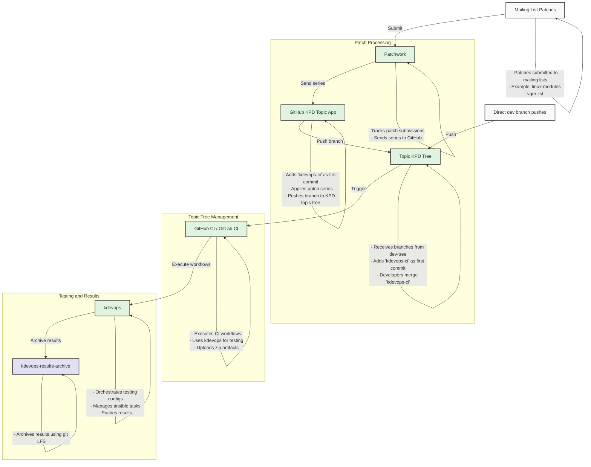

# kdevops's kernel-ci

The kdevops kernel-ci supports testing both simple and extremely complex Linux
kernel subsystems, allowing developers to proactively test patches posted on
the mailing list, test custom branches, or to continuously test Linux so to
avoid regressions and discover new bugs.

To avoid regressions baselines can be developed and used and are an optional
part of the kdevops kernel-ci process. In order to support testing patches from
mailing lists
[kernel-patches-daemon](https://github.com/facebookincubator/kernel-patches-daemon)
(kpd) can optionally be used and is supported.

The CI part of github and gitlab are called Github actions and GitLab Pipelines
respectively. To keep things simple we refer to both as ``git CI solutions``.
Both ``git CI solutions`` are optionally supported to leverage
triggering tests on custom repositories with custom branches. Either
[kpd](https://github.com/facebookincubator/kernel-patches-daemon)
can push custom branches to test or developers can manually push custom
branches to test. Once confidence on a CI pipeline is high, tests against
new Linux releases can also be automated.

Both self-hosted runners and cloud solutions can be used. Manually running
kdevops tests is also possible. Below we provide an ASCII art image
representation of what this looks like.

  * [Alternative ASCII flow chart](kdevops-ci-ascii-flow-chart.md)

# Active kdevops CIs

The below are active kdevops CIs used to help developers proactively test
patches either from the mailing list for different Linux kernel subsystems,
or to help increase confidence in a branch to be used as a pull request sent
to Linus. We also have kdevops's own CI. Each CI has its own use case and
documented as such. The kdevops tree has its CI built-in to the main branch
of the development tree. However, to enable to Linux kernel development trees
to *use* kdevops to run tests, the [kdevops-ci tree](kdevops-ci-tree.md) is
can merged into development tree before pushing onto kdevops CI enabled trees.
Read first the [kdevops-ci tree documentation](kdevops-ci-tree.md). The list
of active CI trees leveraging all this and their respective documentation
are:

  * [kdevops CI](kdevops-ci.md)
  * [Linux kernel filesystem kdevops CI](linux-filesystems-kdevops-CI-testing.md)
      * [Linux kernel XFS kdevops CI](linux-xfs-kdevops-ci.md)
  * Linux kernel simple subsystems:
      * [Linux kernel modules kdevops CI](linux-modules-kdevops-ci.md)
      * [Linux kernel firmware loader kdevops CI](linux-firmware-kdevops-ci.md)
  * [Linux kernel mm kdevops CI](linux-mm-kdevops-ci.md)

# kernel-patches-daemon support

Manual tests are just one way to run tests on kdevops. You can also proactively
test from patches posted on the development mailing list.

The use of
[kernel-patches-daemon](https://github.com/facebookincubator/kernel-patches-daemon)
(kpd) is only important if you want to proactively test all patches
posted to a subsystem mailing list.  Using kpd requires a patchwork project
created for you under kernel.org, these are typically configured to aggregate
all patches from a mailing list. However, smaller subsystems can leverage new
patchwork support from kernel.org which leverages lei support, allowing
custom filters for which patches should be queued up. For more details
on kpd support see [kdevops kpd integration](kernel-ci-kpd.md)

# Leveraging existing git CI solutions for Linux kernel development

GitHub CI/CD and GitLab Pipelines provide support for Continuous
Integration (CI) and (Continuous Integration). They both provide automation
features that let you run workflows, tests, builds, and deployments based on
triggers like commits, pull requests, or specific schedules.

From a Linux kernel development perspective we're more interested in the CI
(Continuous Integration) part: running tests, building code, running tests
whenever code is posted or committed or pushed.

In Linux the CD (Continuous Delivery/Deployment) part, which deals with
automating deployment, pushing changes to staging production is already dealt
with through the Linux development workflow. The linux-next tree is used
for continuous delivery of the latest subsystem trees. There are also
specialized trees such as fs-next which aggregate only the filesystem specific
parts of this so to avoid having to deal testing for example graphics. By
the time we get to the merge window, most code should have been tested and
vetted for.

The CI part of github and gitlab are called Github actions and GitLab Pipelines
respectively. To keep things simple we refer to both as ``git CI solutions``.

# The case for self-hosted runners

Today's CI git solutions allow for free runners which leverage containers
or with self-hosted runners. Although you can technically pull off using
virtualization inside a container a
[review of CI runners](https://lore.kernel.org/r/CAB=NE6VKWSkv1JZ_Z2LKq4o7+JBkKc6u8Wa1zxxBnGHOG4BgjA@mail.gmail.com)
concluded a containerized solution doesn't help much.

If you're going to leverage a git CI solution with kdevops you want to use
self-hosted runners.

## Locking down your organization for CI

Since self-hosted runners are the only sensible solution for a kdevops CI,
you want to make the default base permissions to not allow anyone other than
trusted developers to be able to create pull requests, in case any git CI
workflows leverage self-hosted runners.

The alternative is to disallow pull requests on your git CI as triggers
for you self-hosted runners since most organizations by default disable
pushes for unprivileged users to the organization.

# Github CI solution

Github CI is implemented by leveraging yaml files in `.github/workflows/`
directory of your project. There are two separate ways we leverage github CI,
one for testing kdevops itself and making sure kdevops keeps working, and
another is for Linux kernel development. The github CI for kdevops is part of
kdevops itself, in the `.github/workflows/` directory. The github CI targeted
for Linux kernel developers is managed through a separate tree, the
[kdevops-ci](https://github.com/linux-kdevops/kdevops-ci) which is intended to
be used as a merge into your Linux kernel development tree once you want testing
for it.

# kdevops CI results

Since CI provides the automation test vehicle we want a way to collect results.
Today's git CI solutions only provide ephemeral results archiving. For Linux
kernel development we want test results which will we can always procure. To
address this the
[kdevops-results-archive](https://github.com/linux-kdevops/kdevops-results-archive)
automatically allows us to capture results leveraging
[git LFS](https://git-lfs.com/) on the backend. Using git LFS we can allow
folks to only gather specific results they are interested and allow git host
providers to leverage their preferred storage solutions for archiving cold data.
This also increases the max tarball we can support, and allows us to use epochs
for achiving, enabling easy transitions to new epochs on the same tree.

## The kdevops github CI

The kdevops project leverages a github CI, for details refer to
[kdevops CI](kernel-ci-kdevops.md) for details on how and what
kdevops needs to test, and for test results look at the
[kdevops actions results page](https://github.com/linux-kdevops/kdevops/actions).

## The kdevops-ci for Linux kernel development

You can just merge your subsystem
[kdevops-ci](https://github.com/linux-kdevops/kdevops-ci)
topic branch on your subsystem development branch to enable testing of your
code for that subsystem through your self hosted runners. For details refer
to the [kdevops-ci documentation](kernel-ci-kdevops-ci.md).

# Gitlab CI solution

This just requires an eager beaver to cat the existing github CI files into
an AI agent and as it to port it to gitlab, then test it with a self-hosted
gitlab runner.

# kdevops runner requirements

If you're going to use kdevops for a CI solution, you will need enough
system resources either locally for VMs or on the cloud to run your tests.

# kdevops kernel-ci automation framework

Instead of inventing its own wheel to deal with management of guests, Ansible
has been embraced for detailing how to codify required commands for each
target workflow. Adding Salt support in the future as an alternative for
management can surely be done, it would just be a matter of extending new
Kconfig symbols. Using Ansible was done first as that is what the author had
most experience with.

Each target test is considered a "workflow" under kdevops. Using Ansible also
allows for distribution specific items to be split out and dealt with
separately. As it stands, support for OpenSUSE, SUSE, Debian, and Fedora are
provided for all supported workflows. If a new workflow is added, you don't
need to add support for all distributions, a Kconfig "depends on" logic can
easily be used to ensure only support for the few distributions is expressed.
As it stands though, all currently supported workflows support all supported
distributions, and developers are highly encouraged to try to add support for
all of them as well, as the differences in support typically mostly deals with
package names, GRUB and the kernel, and that is already dealt with in existing
workflows.

Below is kdevops' kernel-ci recommended documentation reading before trying to
enable kdevops kernel-ci and using it.

  * [Reviewing existing kernel-ci efforts](review-existing-kernel-ci-efforts.md)
  * [Using kdevops as a git subtree in light of kernel-ci](kdevops-subtree-recommeded.md)
  * [Recommended methodology to a define kernel-ci host and guest architecture](recommendations-kernel-ci-architeture.md)
  * [A case for truncated files with loopback block devices](/docs/testing-with-loopback.md)
  * [Seeing more issues with loopback / truncated files setup](/docs/seeing-more-issues.md)
  * [kernel-ci guest requirements](kernel-ci-guest.md)
  * [kernel-ci host requirements](kernel-ci-host.md)
  * [kernel-ci host hypervisor tuning](kernel-ci-hypervisor-tuning.md)
  * [kernel-ci steady state goals](kernel-ci-steady-state-goal.md)
  * [Targetting tests based on commit IDs or branches](kernel-ci-test-trigger-code-inferences.md)
  * [Appreciating kernel-ci division of labor](kernel-ci-division-of-labor.md)
  * [Evaluating use of a digital ledger](kernel-ci-digital-ledger.md)
