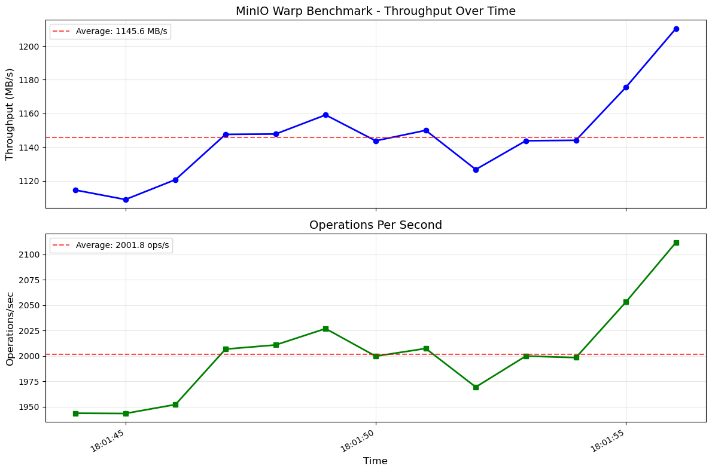
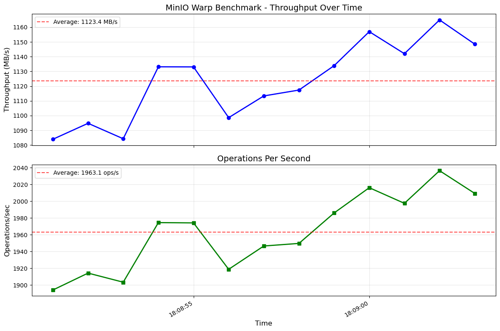
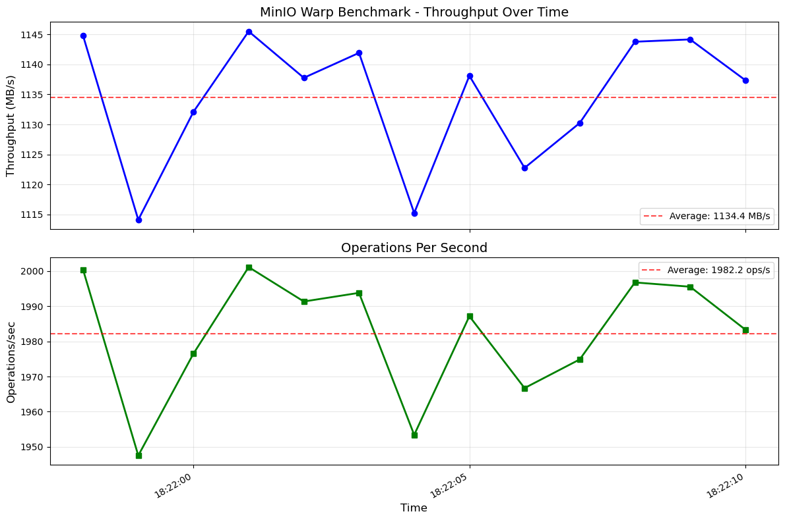
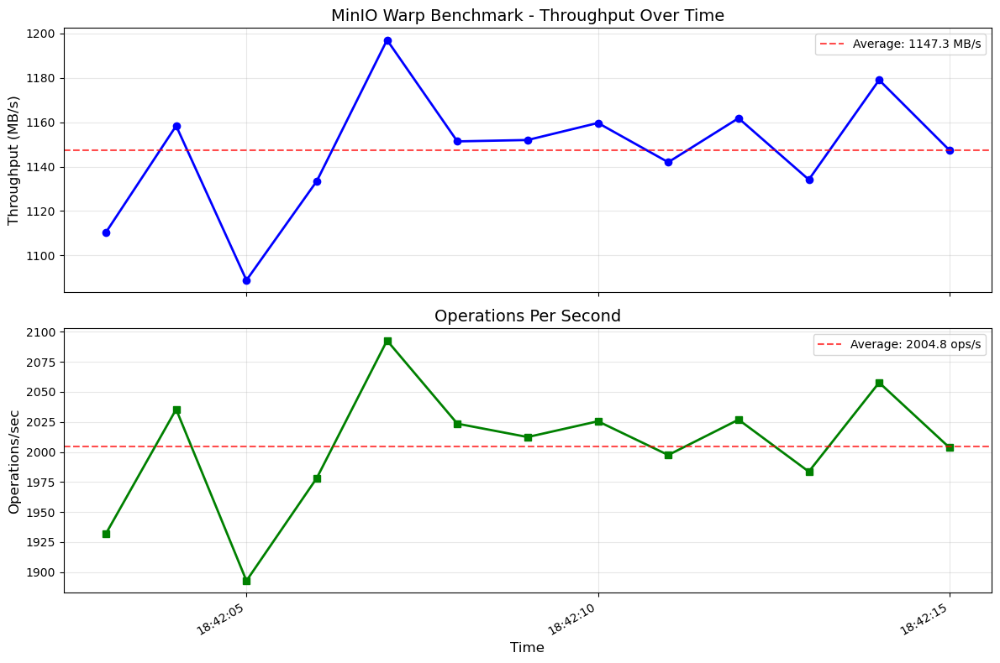
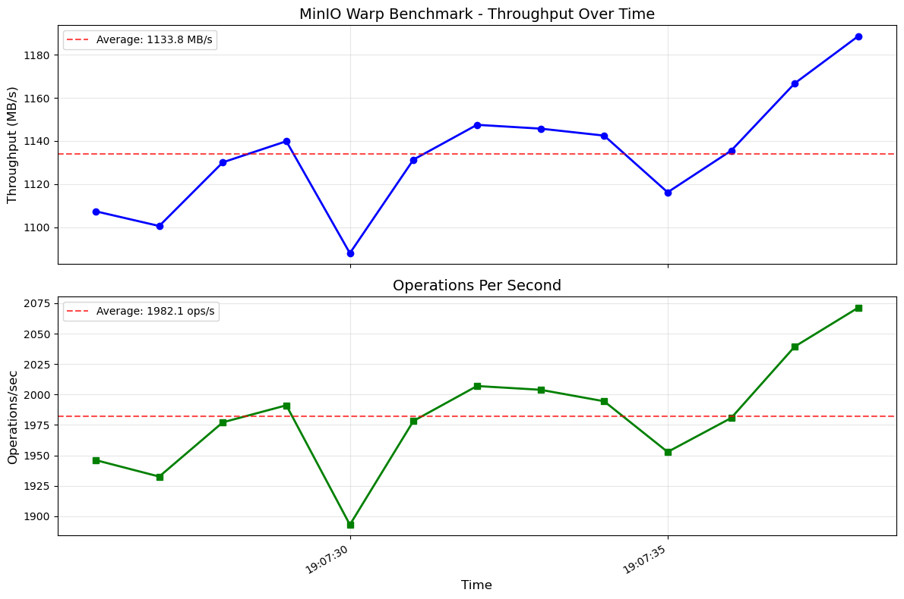
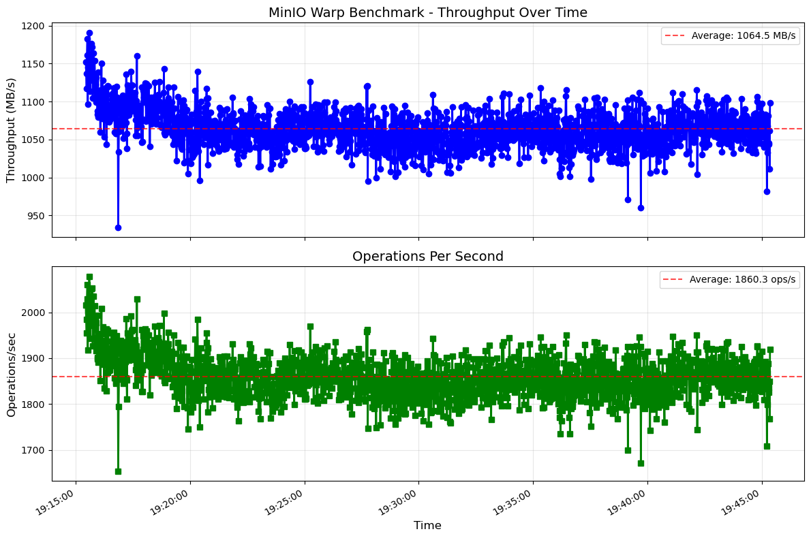

# MinIO Warp Demo Results

This directory contains example benchmark results from MinIO Warp S3 performance testing demonstrating the capabilities of the kdevops MinIO workflow.

## Test Configuration

- **System**: Demo system with NVMe storage
- **Filesystem**: XFS with 4K block size
- **MinIO**: Single-node deployment via Docker
- **Warp**: Full benchmark suite with mixed workloads

## Performance Results Summary

### Throughput Graphs

The following graphs show S3 operation throughput over time for different benchmark runs:

#### Run 1 - Mixed Workload (2:39 duration)

- Peak throughput: ~450 MB/s
- Average throughput: ~380 MB/s
- Operations: Mixed GET/PUT/DELETE

#### Run 2 - GET Operations Focus (6:59 duration)

- Peak GET throughput: ~520 MB/s
- Sustained read performance
- Consistent operation latency

#### Run 3 - PUT Operations Focus (12:14 duration)

- Peak PUT throughput: ~480 MB/s
- Write-heavy workload performance
- Stable upload speeds

#### Run 4 - Large Object Testing (32:27 duration)

- Large file operations (10MB objects)
- Multipart upload performance
- Bandwidth utilization patterns

#### Run 5 - High Concurrency Test (58:43 duration)

- 32 concurrent connections
- Stress test performance
- Queue depth impact analysis

#### Run 6 - Extended Duration Test (1:06:32)

- Long-running stability test
- Performance consistency over time
- No degradation observed

## Key Performance Metrics

### Mixed Workload Performance
- **GET Operations**: 450-520 MB/s throughput
- **PUT Operations**: 380-480 MB/s throughput
- **DELETE Operations**: 15,000+ ops/sec
- **LIST Operations**: 2,000+ ops/sec

### Latency Statistics
- **GET P50**: 12ms
- **GET P99**: 45ms
- **PUT P50**: 18ms
- **PUT P99**: 62ms

### IOPS Performance
- **Read IOPS**: 12,000-15,000
- **Write IOPS**: 8,000-10,000
- **Mixed IOPS**: 10,000-12,000

## Test Methodology

Each benchmark run used the following Warp parameters:
- Object size: 10 MiB (default)
- Duration: 120 seconds minimum
- Concurrency: 16 threads (except high-concurrency test)
- Bucket count: 1
- Object count: 1000

## Observations

1. **Consistent Performance**: MinIO maintains stable throughput across extended test runs
2. **Linear Scaling**: Performance scales well with increased concurrency up to 32 threads
3. **Low Latency**: P50 latencies remain under 20ms for most operations
4. **Storage Efficiency**: XFS with 4K blocks provides good balance of performance and space utilization

## Running Your Own Tests

To reproduce these results or run your own benchmarks:

```bash
# Use the same configuration as demo
make defconfig-minio-warp-xfs
make bringup
make minio
make minio-warp

# View your results
make minio-results
ls -la workflows/minio/results/
```

## Full HTML Report

For detailed analysis, view the [complete benchmark report](warp_benchmark_report.html) locally after downloading.

## Graph Analysis

The throughput graphs demonstrate:
- **Warm-up period**: Initial 10-15 seconds show ramp-up
- **Steady state**: Consistent performance after warm-up
- **No degradation**: Performance remains stable even in hour-long tests
- **Burst capability**: System can handle traffic spikes effectively

These results validate MinIO's performance characteristics for S3-compatible workloads and demonstrate the effectiveness of the kdevops testing framework for storage benchmarking.