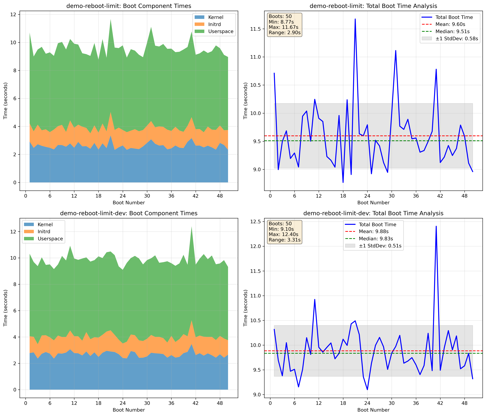

# The reboot-limit workflow

The reboot-limit workflow is designed to test system stability by performing
continuous reboots and collecting boot performance metrics. This helps identify
boot-related regressions, hardware issues, or kernel stability problems that
only manifest after multiple boot cycles.

## Purpose

The primary goals of the reboot-limit workflow are:

1. **Stability Testing**: Verify that a system can reboot reliably over many cycles
2. **Performance Analysis**: Track boot time trends and identify performance regressions
3. **Hardware Validation**: Detect hardware issues that only appear after thermal cycling
4. **Kernel Testing**: Validate kernel changes don't introduce boot-related regressions

## Features

- Multiple reboot methods (Ansible, systemctl reboot, systemctl kexec)
- Boot performance tracking via systemd-analyze
- Configurable crash injection for resilience testing
- Loop testing for continuous operation until failure
- A/B testing support for comparing baseline vs development kernels
- Comprehensive visualization and analysis tools

## Configuration

Enable the reboot-limit workflow in your kdevops configuration:

```bash
make menuconfig
# Navigate to: Workflows → reboot-limit
# Enable the workflow and configure options
```

### Key Configuration Options

- **Reboot test type**: Choose between Ansible module, systemctl reboot, or systemctl kexec
- **Boot count**: Number of reboots per test run (default: 100)
- **Loop testing**: Enable continuous testing until failure or steady state
- **Data collection**: Enable systemd-analyze data collection for performance tracking
- **Crash injection**: Force crashes at intervals to test recovery mechanisms

## Running the Tests

### Basic Commands

```bash
# Initial setup (creates /data/reboot-limit directory)
make reboot-limit

# Run baseline test (performs configured number of reboots)
make reboot-limit-baseline

# Run development test (for A/B testing)
make reboot-limit-dev-baseline

# Reset boot counters
make reboot-limit-baseline-reset
```

### Loop Testing

For continuous testing until failure or steady state:

```bash
# Run baseline in a loop
make reboot-limit-baseline-loop

# Run with kernel-of-the-day updates
make reboot-limit-baseline-kotd
```

## Data Collection

The workflow collects two types of data for each host:

1. **Boot count** (`reboot-count.txt`): Current boot number
2. **Boot timing** (`systemctl-analyze.txt`): systemd-analyze output for each boot

Data is stored in:
- On nodes: `/data/reboot-limit/<hostname>/`
- Locally: `workflows/demos/reboot-limit/results/<hostname>/`

## Analyzing Results

After running tests, analyze the results to understand boot performance:

```bash
# Generate summary statistics
make reboot-limit-results

# Generate visualization graphs
make reboot-limit-graph
```

### Visualization Output

The analysis generates comprehensive graphs showing:

1. **Boot Component Times**: Stacked area chart showing kernel, initrd, and userspace times
2. **Total Boot Time Analysis**: Line graph with statistical indicators (mean, median, standard deviation)



The visualization helps identify:
- Boot time trends over multiple reboots
- Performance spikes or anomalies
- Component-specific slowdowns (kernel vs userspace)
- Statistical variance in boot times

### Understanding the Results

The analysis provides:

- **Summary Statistics**: Min, max, mean, median, standard deviation
- **Component Breakdown**: Average times for kernel, initrd, and userspace
- **Visual Trends**: Graphs showing performance over time
- **Anomaly Detection**: Spikes visible in the timeline

## Advanced Usage

### Crash Injection Testing

Test system resilience by forcing crashes at intervals:

```bash
make menuconfig
# Enable: Force a crash after certain period of reboots
# Set: After how many reboots should we force a crash
```

This helps validate:
- Crash recovery mechanisms
- Filesystem consistency after unexpected shutdowns
- Hardware error recovery

### A/B Testing

Compare baseline and development kernels:

1. Configure for A/B testing with separate baseline/dev nodes
2. Run tests on both node groups
3. Compare results using the visualization tools

### Integration with CI/CD

The reboot-limit workflow supports integration with continuous integration:

- Exit codes indicate test success/failure
- Results are machine-parseable for automation
- Loop testing can run until steady state is achieved

## Troubleshooting

### Common Issues

1. **DHCP Timeout**: If reboots fail due to network issues
   - Check DHCP server configuration
   - Increase Ansible timeout values

2. **Systemd-analyze Failures**: If timing data isn't collected
   - Ensure systemd-analyze is available on target systems
   - Check that boot has completed before collection

3. **Storage Issues**: If data collection fails
   - Verify `/data` partition has sufficient space
   - Check file permissions on target nodes

### Debug Options

Enable verbose output for troubleshooting:

```bash
# Ansible verbose mode
make reboot-limit-baseline AV=3

# Check individual node status
ansible baseline:dev:service -m shell -a "cat /data/reboot-limit/*/reboot-count.txt"
```

## Interpreting Performance Data

### Normal Patterns

- Consistent boot times with minor variations (±10%)
- Occasional spikes (1-2% of boots) due to system maintenance
- Gradual improvement over first few boots (cache warming)

### Warning Signs

- Increasing trend in boot times
- Large standard deviation (>20% of mean)
- Component-specific degradation
- Frequent outliers or spikes

## Best Practices

1. **Baseline First**: Always establish a baseline before testing changes
2. **Multiple Runs**: Use loop testing for statistical significance
3. **Monitor Resources**: Check disk space before long runs
4. **Save Results**: Archive results for historical comparison
5. **Regular Analysis**: Review trends periodically

## Workflow Architecture

The reboot-limit workflow consists of:

- **Ansible Playbook** (`playbooks/reboot-limit.yml`): Orchestrates the test
- **Ansible Role** (`playbooks/roles/reboot-limit/`): Implements test logic
- **Analysis Tools** (`scripts/workflows/demos/reboot-limit/`): Process results
- **Configuration** (`workflows/demos/reboot-limit/Kconfig`): User options

## Contributing

To enhance the reboot-limit workflow:

1. Additional metrics collection (e.g., dmesg timing, service startup)
2. More reboot methods (e.g., IPMI, hardware reset)
3. Enhanced visualization options
4. Integration with other workflows

See the [contributing guide](contributing.md) for more details.
