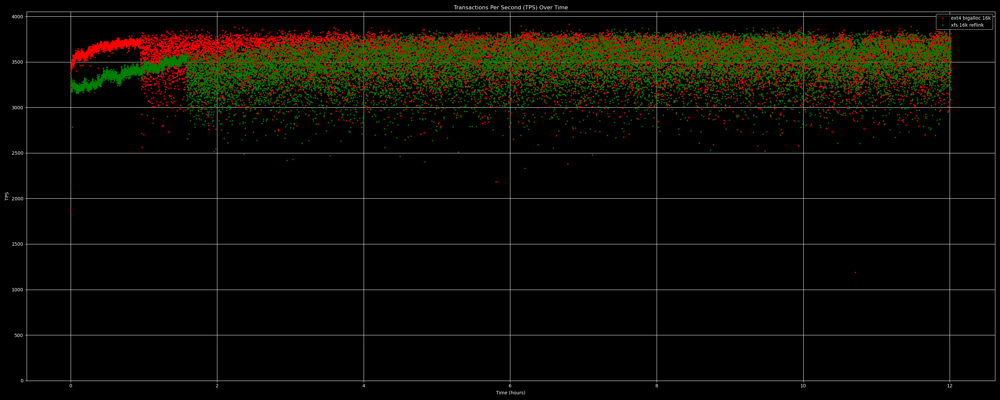
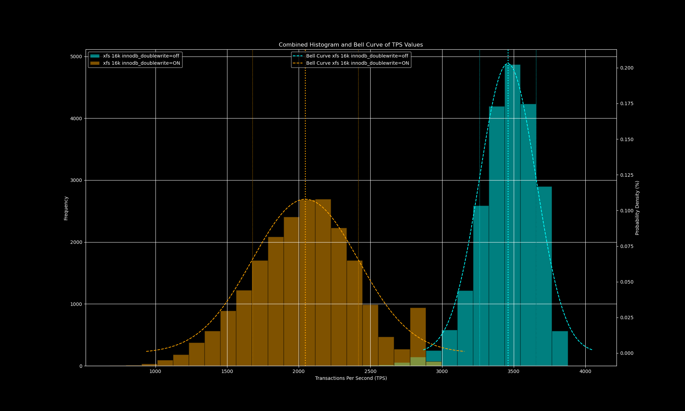
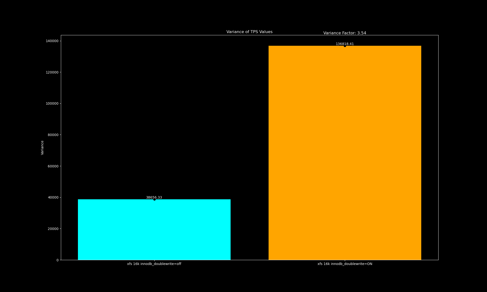
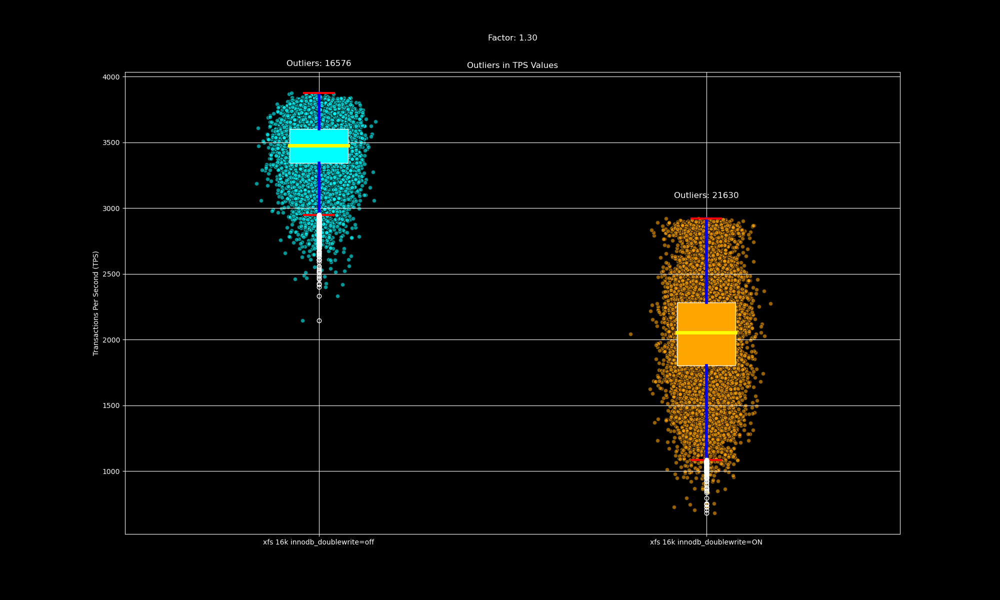

Sysbench workflow on LBS
========================

[Sysbench](https://github.com/akopytov/sysbench)
[FOSDEM 2017 PDF slides](https://archive.fosdem.org/2017/schedule/event/sysbench/attachments/slides/1519/export/events/attachments/sysbench/slides/1519/sysbench.pdf)
is a scriptable multi-threaded benchmark tool used for benchmarking databases.

kdevops supports automating tests with sysbench, and the first test it supports
is one focused on quantifying TPS variability results when one disable the
MySQL double write buffer only across a series of different filesystems. kdevops
makes adding support for testing TPS variability on different filesystems
easy, and allows you to easily run these tests on bare metal, virtualized
guests (optionally with
[kdevops PCIe passthrough](../libvirt-pcie-passthrough.md))
and on different cloud providers which kdevops supports.

Support was based on transcribing an initial simple shell docker proof of
concept
[plot-sysbench](https://github.com/mcgrof/plot-sysbench)
into kdevops.
Results of using
[plot-sysbench](https://github.com/mcgrof/plot-sysbench)
on AWS i4i.4xlarge instance was used with debian-12 image, docker MySQL and
sysbench images and plots for a 12 hour run collected below to demonstrate what
you should expect with automation from kdevops. Initial testing with of the TPS
variability workflow on kdevops has been done with VMs only, but enough work is
in place to easily verify / extend it with
[kdevops PCIe passthrough](../libvirt-pcie-passthrough.md)
and cloud support, it should just be a matter of a few Kconfig changes, and then
also for cloud making sure we move around some folders into partitions with more
space like the docker folders as some cloud instances use a small root disk. For
demonstration purposes image results from
[plot-sysbench](https://github.com/mcgrof/plot-sysbench) are used for now but
the same should easily be possible with kdevops on the cloud as well.

# Running TPS variability tests

Just use:

```bash
make defconfig-sysbench-mysql-atomic-tps-variability
make -j$(nproc)
make bringup
make linux
make sysbench
make sysbench-test
```

The results will be placed in workflows/sysbench/results/

## Bringup tests

Below are the bringup methods tested so far which should work well

  * VMs with guestfs

## TODO

 * Test VMs with PCI passthrough
 * Test at least one cloud provider
 * Add PostgreSQL support

# Definitions

## TPS variability

We define the TPS variability the square of the standard deviation.

## TPS outliers

Outliers are TPS values 1.5 outside
[IQR](https://en.wikipedia.org/wiki/Interquartile_range).
There is likely a better value other than 1.5, a database expert should provide
input here.

# Example image results from kdevops

## TPS changes

### xfs 16k vs ext4 bigalloc 16k - 12 hour MySQL run

This compares XFS with 16k block size filesystem against ext4 using a 4k
block size and 16k bigalloc cluster size.



### xfs 16k the effects of disabling the double write buffer

This compares running XFS with a 16k block size filesystem on two nodes, with
one node with the double write buffer enabled Vs on the other node the double
write buffer disabled.

TPS results:


Visualizing TPS variability: since TPS variability is defined as the square of
the standard deviation, this image shows us what the standard deviation is
using a bell curve. The standard deviation starts at the center peak of the
curve and is the length from the center to the right or left of the same
colored vertical dotted line.



TPS variability factor change: this just squares the standard deviation. But
it visualizes the delta in terms of factors of the difference in TPS
variability.



Visualizing TPS outliers: using the definition of an outlier above, this
visualizes the outliers, those outside the box.



kdevops has a way to do a factor analysis.

# Hacking

Things to know if you're going to hack on this.

## Use of Kconfig for support

Everything is defined through Kconfig, specially now that
kdevops supports an extention of kconfig which lets us be selective over
which Kconfig symbols we want to propagate onto kdevops extra_vars.yaml.
Look for "output yaml" on Kconfig files.

Adding different filesystems and filesystems configurations should mostly be
a matter of Kconfig edits.

To review support for PCI passthrough or cloud support all you need to do is
extend modify SYSBENCH_DEVICE so the correct drive is used in
workflows/sysbench/Kconfig.fs. For example right now:

  * if libvirt is used and virtio is used /dev/disk/by-id/virtio-kdevops1 is used
  * if libvirt is used and nvme   is used /dev/disk/by-id/nvme-QEMU_NVMe_Ctrl_kdevops1 is used
  * if the AWS m5ad_4xlarge instance is used  /dev/nvme2n1 is used and
  * if OCI is used the sparse volume defined in TERRAFORM_OCI_SPARSE_VOLUME_DEVICE_FILE_NAME
is used.

Experience shows at least that AWS needs also some pre-run work to ensure all
extra data for docker is on a partition which won't fill /. Future work to
kdevops should be done for cloud providers per type of target instance to
adjust data.

Since we already have support for testing fstests with real NVMe drives with
[kdevops PCIe passthrough](../libvirt-pcie-passthrough.md) support, it should
easily be possible to leverage that as a way to also support for
[kdevops PCIe passthrough](../libvirt-pcie-passthrough.md) for sysbench testing.
